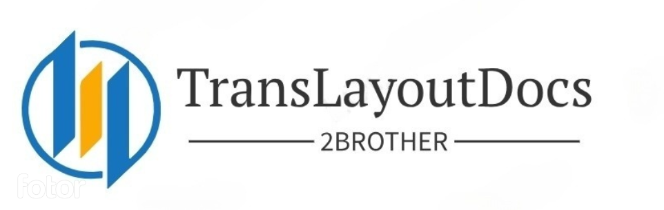
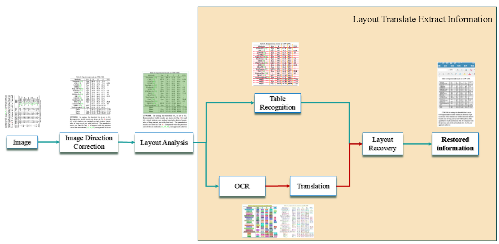
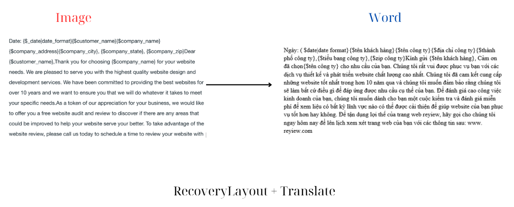

# TransLayoutDocs
Translate documents, recreate layouts, convert PDF to Word, PaddleOCR, Image to Word.

<div align="center">
<!-- width=120 height=120 -->
 
<h1>TransLayoutDocs</h1>

 🌎 English / [Vietnamese](README_vn.md) / [日本](README_jp.md)

</div>
<br>

> **Related Projects**：
>
> - [Recognition-table-with-table-transformer](https://github.com/KaiKenju/Recognition-Table-with-Table_Transformer-and-vietOCR): A system combining Table Transformer and vietOCR for accurate table structure and Vietnamese character recognition from images.
>
> - [Vietnamese_OCR_documents](https://github.com/KaiKenju/Vietnamese_OCR_documents): Converts text from images or PDF scans into digital format, streamlining Vietnamese text processing and information management.
<br>

<br>

# Table of Contents

# Technical Overview
- **Python** > 3.6
- **Recovery Layout**: PPStructure (PaddleOCR)
- **OCR**: PaddleOCR
- **Translation** : 
  - mbart-large-50-many-to-many-mmt(jp)
  - envit5-translation(vi)
- **Spell Corection**
  - oliverguhr/spelling-correction-english-base(en)
  - bmd1905/vietnamese-correction(vi)
                

# Introduction

This diagram introduces the Layout Translation Extraction process we developed based on [PaddleOCR](https://github.com/PaddlePaddle/PaddleOCR/blob/main/README_en.md), from image correction to information reconstruction. You can read the docs [here](https://paddlepaddle.github.io/PaddleOCR/latest/en/ppstructure/overview.html#1-introduction) to see differences

<div align="center">
    
</div>

# Visualization

- Image: RecoveryLayout 

<div align="center">
    
</div>

- Image: RecoveryLayout + Translate
 
<div align="center">
    
</div>

# Installization 
- Clone  this project:

```[bash]
git clone https://github.com/KaiKenju/TransLayoutDocs.git
```

- Initial enviromment with Miniconda (Default: python=3.10):

```[bash]
conda create -n <env_name> python=3.10
```
- Activate conda
```[bash]
conda activate <env_name> 
cd TransLayoutDocs
```
- Run the commands:
```[bash]
pip install -r requirements.txt
```

# Quick Start
```[bash]
python main.py
```

- Image to Word
```[bash]
python img2docx.py --input=./inputs/imgs/check2.png --output=./detail_img --lang=vi --device=cpu
```

```console
Usage: python img2docx.py --input=./inputs/imgs/chap4.png --output=./detail_img --lang=vi --device=cpu

  --input              Input img . Default: inputs
  --output             Output folder. Default: detail_img
  --device             cpu or cuda. Default: cpu
```

- Note: Following the step if you translate in KR,JP,CH to see in terminal : [here](https://www.youtube.com/watch?v=DQAox26W4s8)

## Contributer

Special thanks to all the developers who have contributed to TransLayoutDocs! 

<table id='Contributes'>
<tr align='center'>
    <td id='KaiKenju'>
        <a href='https://github.com/KaiKenju'>
            
        </a>
        <br>
        <a href='https://www.linkedin.com/in/hiep-dinh-a23bb52b8/'>KaiKenju</a>
    </td>
    <td id='hungtrieu07'>
        <a href='https://github.com/hungtrieu07'>
            
        </a>
        <br>
        <a href='https://www.linkedin.com/in/hungtrieu07/'>hungtrieu07</a>
    </td>
</tr>
</table>
